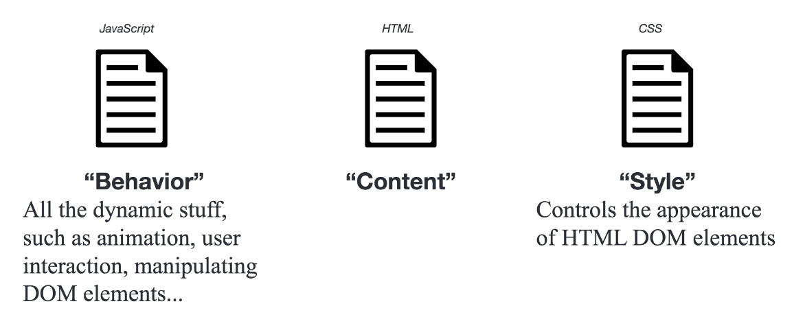
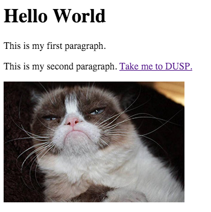

# Front End Environments
## HTML/CSS/JavaScript: An Overview

All the files you will want to use today are provided in the Week 6
folder of the class repo. The files for the website are in the **big-data** folder in your materials.

### Instructions

**Consuming the materials is a bit different this week. We aren't working in Python, we are making a website, and you won't use a Jupyter notebook! You can read the materials directly from github. This document is written in something called [Markdown](https://github.com/adam-p/markdown-here/wiki/Markdown-Cheatsheet). All of the work will be done by writing website code in Sublime Text.**

After you **fetch and checkout the folder for the week**, you should **add, commit, and push it to your own repository**. Then navigate to your repository on github.com, read the materials from there, and perform the work in Sublime Text on your own machine.

In the following steps, we are going to create a website. To do so, we'll create a blank text document, fill it with HTML code, save it as an HTML file, and view results in our browser. Through the exercise in Part 1, we will learn the concepts of HTML, style the page with CSS, and, in Part 2, add interaction using JavaScript.

*How is everything related?*



HTML, standing for [HyperText Markup Language](https://en.wikipedia.org/wiki/HTML), organizes the **content** of your page by creating elements in which your page materials are contained.

## Getting Started

We are going to work with the website repository we created in the first week of class. You each have a github.io repo you have created, so do all of your work within this repository.

1. Get a copy of the materials using fetch and checkout.
2. Commit and push the files to your own repo.
3. View the markdown document (.md) on github.com in your repository.
4. Write all of your code in Sublime Text, and save your files in your web folder.

Copy the entire **big-data** folder from the main class repo to your **username.github.io** directory. Then use terminal to **change directory** to the root of the repository (website). This is our web directory that you can access by opening a web browser (such a Chrome) and navigating to **username.github.io/big-data**.

### Organize your Directory

A web directory should be organized in the following basic manner. This is simplified, you will find like assets separated into folders.


When a browser requests your page, your server will return the index.html file in the root-directory. The **index.html** is your 'root' or 'home' page.

Note that you don't see an **index.html** in the materials. We are going to create the **index.html** page in the upcoming steps.

### Use a Text Editor

Write all of your code using a text editor such as [Sublime Text](https://www.sublimetext.com/). To complete the exercise, you will want to edit the files in the web folder using Sublime Text. You should have this installed, but not, please [download](https://www.sublimetext.com/) it and install it at this time.

### Set up a Development Environment Using Python

To work with our website, we need our computer to act like a web server, allowing it to access files online. A great development web server is built right into Python. Use the Terminal to **change directory** to your **username.github.io** repository in your github folder (this is the one you just copied your files to).

Once there, type the following to start a simple Python server:

```xml
$ python -m http.server 8080
```

With this running, open a web browser (i.e. Chrome) and access your site at: **http://localhost:8080**

You might get a message that pops up with a note about accepting incoming connections or your Firewall. This is not a problem, you can click OK.

When you modify and change files in web folder, just save the files, then refresh your page in the browswer. Your page will appear as it would if it were live on the internet, and changes will be shown, except this is only visible to you locally. This is called a development environment, and allows us to test changes and edit our site as if it were live on the web, but it not modifying anything actually live.

**Once this is done, you can ignore your Python terminal and just let it run in the background. If you want to stop the server, use CTRL-C.**

## Part1: HTML/CSS

### HTML: The Core Concepts

Let's get started! Create a new blank text document in Sublime Text and save it as **index.html** in your folder. The following introduces the core concepts behind HTML.

All HTML documents start with the following line of code:

```xml
<!DOCTYPE html>
```

This tag states to the browser that the rest of your file will be written using HTML. 

HTML is a markup framework language, and acts as the bones of any website. Content is organized into elements, which can then be filled with content, made interactive, and styled.

```xml
<element>Content goes here!</element>
```

A **void element**. Some elements are contained in one tag, such as images. These elements are called void elements.

```xml
<element />
```

A **comment**. Comments look like the following. They are used to write human-readable notes in your code, but are ignored by the browser.

```xml
<!-- This is a comment -->
```

A basic page, all together, will look like this.

```xml
<!DOCTYPE html>
<html lang="en">
	<head>
    	<meta charset="utf-8"> 
    	<title>Hello World</title>
	</head>
	<body>
		<!-- This is a comment -->
		<h1>Hello World</h1>
		<div id="main">
			...
		</div>
	</body>
</html>
```

Copy and paste this code into a blank text document in Sublime, and save it in your **github.io/big-data** repository as *index.html*. This will now become the main page for your big-data page on your website.

Save it and view it at **http://localhost:8080/big-data**.

### The DOM: Document Object Model

To help us organize the elements, we use something called the Document Object Model (or DOM). The [Document Object Model](https://www.w3.org/DOM/) represents the hierarchy of elements in our page, and is also the interface that allows programs and scripts to dynamically access and update the content, style, and structure of the page.

This is diagrammed using something called the **DOM Tree**, and it consists of our HTML elements.

*The DOM Tree*


#### Fundamental Tags

**Head** and **Body** elements are large containers.

```xml
<!-- HEAD element containing meta information, style, and links -->
<head>
	...
</head>
<!-- BODY element containing all document content elements -->
<body>
	...
</body>
```

**Links, Images** and **Paragraphs**

```xml
<!-- LINKS. A is used to define a hyperlink -->
<a href="http://somesite.www">...</a>
<!-- IMAGE tag to define a link to an image in your document -->
<!-- It's a VOID ELEMENT -->

<!-- PARAGRAPH tag for large blocks of body text -->
<p>...</p>
<!-- SPAN is for groups of inline elements -->
<span>...</span>
```

**Lists**

[Lists](https://www.w3schools.com/html/html_lists.asp) are useful for itemized data.

```xml
<!-- UL defines an unordered list -->
<ul>
	<li>...</li> <!-- line in list -->
</ul>
<!-- OL defines an ordered list -->
<ol>
	<li>...</li> <!-- line in list -->
</ol>
```

Types of lists include:

Type | Description
---- | -----------
type="1" | The list items will be numbered with numbers (default)
type="A" | The list items will be numbered with uppercase letters
type="a" | The list items will be numbered with lowercase letters
type="I" | The list items will be numbered with uppercase roman numbers
type="i" | The list items will be numbered with lowercase roman numbers

#### DIV Tags

One of the most common tags is the **div** tag. The **div** tag defines a division or section of an HTML page. One page can contain many **div** elements, and one **div** element can contain many nested elements. The div tag is an element of HTML that allows you to group content into containers (or divisions) you can organize and style on your web page, and divs play nicely with CSS (Cascading Style Sheets). CSS is a style sheet language used for describing the look and formatting of an HTML page, we will introduce it in the next step.

```xml
<div id="main">
	<!-- Content goes here -->
	...
</div>
```

#### Tag Attributes, Classes, and IDs

Tags are specified and defined using attributes, classes, and IDs. These attributes, classes, and IDs allow you to identify specific elements, modify individual elements and groups of elements, and set the characteristics of the elements.

- *Attributes* define properties of the elements. Elements can have multiple attributes. For example, if the element is a link, where does the link take you.

- *Classes* identify a group of elements that operate similarly or work in the same fashion. For example, a button.

- *IDs* identify unique features and allow for and operations to be performed on that unique feature. In each document, each ID should be unique.

*For Example:*

```xml
<a href="http://www.github.com" class="button" id="unique">...</tag>
```

*or*


```xml
<div style="background-color:#0000FF" class="header" id="main">...</div>
```
===

### Modify your Document

Let's get into the document a bit.

#### i. Add Text

Our HTML document is looking bare, we need to add content. We can start by modifying the heading that welcomes visitors to our site and add a couple paragraph elements.

Modify the HTML code on the page to include the following. Add some paragraph **p** elements within the **div** element of your page.

```xml
<h1 id="headtext">Body Heading</h1>
<p class="my_paragraphs" id="foo">This is my first paragraph.</p>
<p class="my_paragraphs" id="bar">This is my second paragraph.</p>
```

The h1 tag signifies a heading, this is a bolded style of text that vary in size ranging from h1 to h6. The p tag signifies a paragraph that can contain large blocks of text. To view a full list of elements available, view the [MDN Element Reference](https://developer.mozilla.org/en-US/docs/Web/HTML/Element).

#### ii. Add a Link

Adding a link to your site is simple. To add a link, we use the a tag. Write the following line of code at the end your second paragraph, just before the p end tag.

```xml
<a href="http://dusp.mit.edu">Take me to DUSP.</a>
```

You have many options for links. [Read about them here](http://www.w3schools.com/tags/tag_a.asp). For example, if you want a link to open in a new page, you can use **target="_blank"** as a property of the A tag.

*Can you add a link that takes you to Google Maps?*

#### iii. Add an Image

Adding an image is just as easy as adding a hyperlink, although a bit different. An image is not stored on your webpage, but it sits on your server, just like your other files. When you display an image in an html file, you are linking to the image. The HTML tells the browser to locate and display it. Therefore, we will follow a multiple step process.

* Locate the folder named **images** that you copied to your web directory. *You will find one image here named **cat.jpg**. Here you store all subsequent images you want to use in your page.*
* Use the **img** tag to link to that image in your **index.html**

Your file structure, once the **images** folder is created and you have copied **cat.jpg**. In other words, the image is now being served.


Now we can add the image to our index.html. The following line of code uses the img tag, and then links to our image. We will use the **src** attribute to name the source of the image. The image is coming from our own server, we don't need to go externally to get it, so we can put the name of the folder and image as our image address.

Copy and paste this following line in between the **body** tags in your **index.html**, after your last paragraph.

If you want to add an image from another page, you can simply include the URL at which the image is located. The following links to an image on Wikimedia.

```xml

```

#### Our Code

At present, your document will look something like the following.

```xml
<!DOCTYPE html>
<html lang="en">
	<head>
    	<meta charset="utf-8"> 
    	<title>Hello World</title>
	</head>
	<body>
		<!-- This is a comment -->
		<h1>Hello World</h1>
		<div id="main">
			<p class="my_paragraphs" id="foo">This is my first paragraph.</p>
			<p class="my_paragraphs" id="bar">This is my second paragraph. <a href="http://dusp.mit.edu">Take me to DUSP.</a></p>
			
			
		</div>
	</body>
</html>
```

Our page, with this code, contains a bit more content now.



*What does our DOM Tree look like at this point?*


* [MDN HTML Element Reference](https://developer.mozilla.org/en-US/docs/Web/HTML/Element)
* [MDN HTML Attribute Reference](https://developer.mozilla.org/en-US/docs/Web/HTML/Attributes)

Our page is a little dull though, let's start with some styling.

===

### CSS: The Core Concepts

#### Cascading Style Sheets

Cascading Style Sheets (CSS) is a styling language used for describing the look and formatting of the elements in an HTML page. It uses the DOM as the way it interfaces with the elemebts, and styles 'cascade' from higher elements in the DOM tree to elements further down.

We are going to be using CSS3, which is the third iteration of the CSS styling language. CSS is a very useful styling system, and allows you to style items on your page according to a number of methods based on the element it falls within (ie div, body, p, etc), the id of the element (ie #main, #myimg, etc), or the class of the element (ie ..

#### Why Cascading?

The language 'cascades' in the effect that if you style an element, any nested elements will get the same styling unless you specify otherwise. For example, if you set the font for your body element, a p (paragraph) will also be set to the same font, unless you specify specifically in the CSS that you want that p to have another font. This is a useful method in that is minimizes the code you need to write and forces you to be careful with your page organization.

#### Link a CSS File to your Site

CSS can be added to style your website in one of a few ways. You can apply CSS to individual elements, embed it within your HTML document, or create a separate CSS file and link it to your HTML doc. In your file, add the following link in **head** section of your document.

```xml
<link href="css/main.css" rel="stylesheet" />
```

Save your document, and refresh your page. Everything should center. This is because we applied CSS code to our document by linking to our style file.

In the materials for this week, locate the file 'main.css'. This is our stylesheet. We can name it anything really, as long as it has the CSS file type. Open this in your text editor to view the contents. It is a very simple bit of CSS that tells everything in the **body** element to center in the page.

```css
body {
	text-align: center;
}
```

All content in the **body** tag are now in the center of the page.

#### Basic Syntax

Basic CSS syntax looks like the following.

```css
[selector] {
	[property]: [value];
}
```

Selectors are page elements, and can be tags, ids, titles, classes, etc. For example, if we want to style everything that falls in the **body** tag, we use the **body** selector as above.

Selectors can be specified **by element:**

```css
p {
	font-size: 12;
}
```

**By class:**

```css
.my_paragraphs {
	background-color: #1d1230;
}
```

**By ID:**

```css
#foo {
	color: #ff0000;
}

#bar {
	color: white;
	background-color: red;
}
```

#### Inheritance and Order of Operations

CSS follows the DOM model, with styles applied to elements higher in the DOM applied to those that are descendents. If selectors are defined in multiple locations in your CSS, which one gets precedence?


There are two general rules of thumb.

* CSS defined last in your document will supersede CSS set on a selector earlier in your document.
* The more specific selector will override the less specific selector. For example, a style set on the body selector will be overridden by a style set on an element within the body, such as one by ID.


#### Properties and Values

There are hundreds of properties you can set using CSS. Some of these include font, color, location on page, opacity, size, etc. An extensive list can be found in CSS reference documents. Two prominent references are by W3Schools and Mozilla, check them out for further reading.

* [MDN CSS General Reference](https://developer.mozilla.org/en-US/docs/Web/CSS/Reference)
* [MDN CSS Common Properties Reference](https://developer.mozilla.org/en-US/docs/Web/CSS/CSS_Properties_Reference)

#### *Style Font and Type Size*

To change the font for all of our document, we change it on the highest level we can by signifying we want to style everything within the html tag. This can be accomplished by adding the following selector and properties to the stylesheet. **Because this is modifying the HTML tag, it will be a very general application of style. To help keep us organized, put this at the top of the document!**

```css
html {
  font-family: Georgia, Times, serif;
  font-size: 24px;
  line-height: 32px;
}
```

Font family prioritizes a list of font names for the selected element. Line height specifies the minimal height of line boxes within the element.

Looking for some good fonts and colors, visit this [Design page on DUSPviz](http://duspviz.mit.edu/resources/#design)

#### *Change Font Color*

Colors can specified using hex, RGB, or a set of [preset supported color names](http://www.w3schools.com/colors/colors_names.asp).

```css
#foo {
	color: #ff0000;
}
```

#### *Change Background Color*

Adjust the color of an element using background color.

```css
.my_paragraphs {
	background-color: #1d1230;
}
```

#### *Pseudo-Classes and Changing Link Color*

Change link colors using the following.

```css
a {
  color: orange;
}
```

In CSS, elements have what are called [Pseudo-Classes](https://developer.mozilla.org/en-US/docs/Web/CSS/Pseudo-classes). Pseudo-classes are keywords added to selectors that specifies a special state of the element to be selected. We signify a pseudo-class using a **:**. For example, one pseudo-class is hover, and it signifies what happens you hover over an element. This can be used to change the color a link turns when you hover over it.

```css
a:hover {
  color: orange;
}
```

#### Chaining

To find selectors that are nested within other selectors, you can use the concept of **chaining**. Chaining is how we identify multiple ids, classes, and selectors.

```css
.my_paragraphs a {
  font-size: 18px;
}
```

[Read more about it here.](https://css-tricks.com/multiple-class-id-selectors/)

#### Developer Tools (Chrome/Firefox)

Modern web browsers have powerful developer tools that let you manipulate and interface with webpages you have navigated to. This is a really handy tool for testing out CSS changes and modifying properties, or just seeing if the page you are working on is operating correctly.

To access them, right click on an element in the page, and select **Inspect Element**.

A window will pop up in your browser, and you can edit the code!

**Fun Task** - Go edit the headlines on NY Times, and change up the fonts, sizes, and colors.

#### The Box Model: Size and Positioning

Every element in your document is represented by a box. These boxes allow you to set properties such as margins around items.  You can check out the box model in the Developer tools.


* **Padding** - The content is surrounded by the padding area, exists between the content and the border.

* **Border** - Every box has a border that exists on the outer edge of the padding area.

* **Margin** - Margin defines the distance between the element and neighboring elements. Margin never has color.

* **Dimensions** - Controls the height and width of the elements.

You can also adjust the margins, padding, and border individually on each side of the element. And example element, along with its styling, is below. Add this to your CSS stylesheet and save to see how it changes our basic webpage.

```css
p {
    padding: 20px;
    width: 320px;
    height: 40px;
    margin-left: 50px;
}
```

#### Positioning

Positioning your element can be one of the trickier parts of working with CSS. There are a couple of ways you can position items.

Value | Description
----- | -----------
static | Default value. Elements render in order, as they appear in the document flow
absolute | The element is positioned relative to its first positioned (not static) ancestor element
fixed | The element is positioned relative to the browser window
relative | The element is positioned relative to its normal position, so "left:20px" adds 20 pixels to the element's LEFT position
initial | Sets this property to its default value. Read about initial
inherit | Inherits this property from its parent element.

Another available property is called is **float**. Float can be used to wrap text around images.

```css
#bar {
    float: right;
}
```

CSS is the way you style your page, learn more by referring to the references, or playing around in a sandbox such as [CSS Desk](http://www.cssdesk.com/).

For your reference, here are some CSS resources.

* [MDN CSS General Reference](https://developer.mozilla.org/en-US/docs/Web/CSS/Reference)
* [MDN CSS Common Properties Reference](https://developer.mozilla.org/en-US/docs/Web/CSS/CSS_Properties_Reference)

===

This is the end of Part 1. **Now, you are ready for the fun stuff... Part 2 introduces JavaScript!**