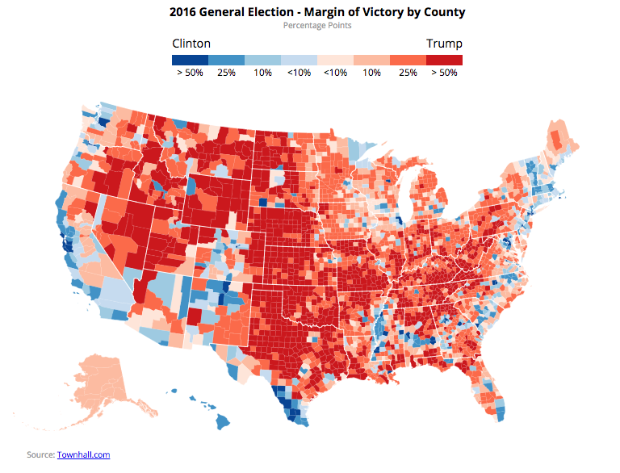
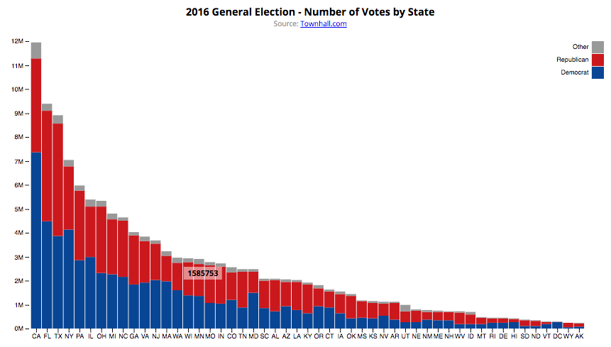

# Front End Environments
## HTML/CSS/JavaScript: Problem Set

# Data Visualization with D3
## Working with D3js: Make a Map and Make a Chart

For the PSET this week, we are going to create two D3 graphics using the national returns from the 2016 November General Election. The first graphic will be a **choropleth map** showing election results by county across the United States, and the second is a **stacked bar chart**, showing the number of votes for Clinton, Trump, and other candidates by state.

### Part 1 - US County-Level Election Results (Map)

In this Part, take this [Choropleth Map of US Counties](https://bl.ocks.org/mjfoster83/82f366218ac32351e0d434c1d959d99e), which currently shows unemployment in 2008, and customize it by changing the data shown to make a map of election results. You are going to be mapping the **percent margin of victory in each county for Clinton and Trump**.

The data you need for this exercise is in the data folder. To complete the exercise, you will need data in **election_2016_county_results.csv**.

The election result data is from [townhall.com](https://townhall.com/). Please include a citation in your map.

We would like you to recreate the following map. You can use some liberty with your design, but should atleast include the following.

With the new data, the webpage containing your map should contain:

* The Counties Basemap
* Data colored according to the Election Data (see hints!)
* A map title with the name of the map.
* A legend. You can put it anywhere on your webpage.
* Credits and attribution.

Help and Hints:
* The data is in a [CSV](https://github.com/mbostock/d3/wiki/CSV), not a TSV. You will have to change this to load the data.
* The values you want to map are in **victory_margin** in the dataset. A positive number represents margin of victory for Trump, a negative number represents margin of victory for Clinton.
* Adjust the ranges by adjusting the [linear scale domain and range](https://github.com/mbostock/d3/wiki/Quantitative-Scales#linear_domain). Manually set breaks, and you can do this by eye, no need for a scientific method at this point. If you want, you can visualize the data in Excel to see the spread.
* Get your own colors from [ColorBrewer](http://colorbrewer2.org/). Use a sequential scheme and copy and paste the hex colors.
* Use the HTML and CSS code for the legend [from this page on Legends with HTML and CSS](https://www.mapbox.com/tilemill/docs/guides/advanced-legends/).

### Part 2 - US State-Level Number of Votes (Bar Chart)

In this Part, take this [Stacked Bar Chart](https://bl.ocks.org/mjfoster83/7c9bdfd714ab2f2e39dd5c09057a55a0), which currently shows population by age group in 2015. We would like you to recreate the following bar chart showing results of the 2016 November General Election by State.

The data you need for this exercise is in the data folder. To complete the exercise, you will need data in **election_2016_state_results.csv**.

You can use some liberty with your design, but should atleast include the following.

1. The results of the fifty U.S. states
2. Show the data in a **Stacked Bar Chart** with the stacks bars of the data representing the numbers for each candidate.
3. Display data by making **Clinton** color **blue** and **Trump** color **red**.
5. Add source information and a legend.

### Help and Hints

* Colors can found at many sites. Try out some of the following color resources: [Color Resources](http://duspviz.mit.edu/resources/)
* Extract the counties from the main dataset, and format the data appropriately in something like Excel before loading into your visualization.
* In-class exercise for this week located at: [http://duspviz.mit.edu/d3-workshop/intro-to-d3/](http://duspviz.mit.edu/d3-workshop/intro-to-d3/)

If you have trouble, please remember to use Stellar!

## Deliverables

Create a page on your github.io website and place each of your graphics on your github.io website.

